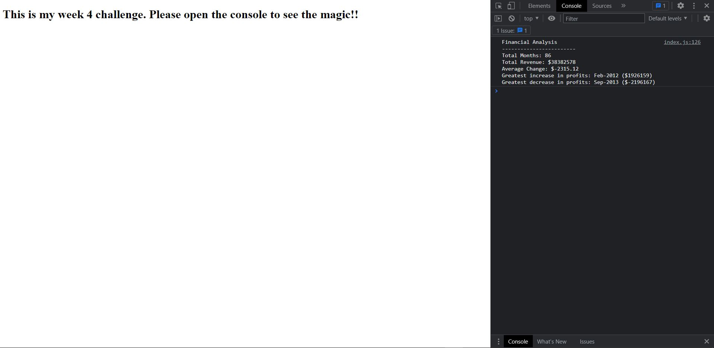

# Preparing Financial Reports from given accounting data

## Description
I used my JS knowledge to prepare financial reports for a company giving detailed breakdown for the term of 86 months.

## Usage 
https://onderguler35.github.io/Console-Finances/

The website can be accessed through the link above. Please remember to open the browser console to see the coding in action.

 

## Credits

I have checked how to round a number to two decimal points using the info at the website below. 
Kudos to the author.

https://www.codegrepper.com/code-examples/javascript/round+to+nearest+hundredth+javascript

 

## License

MIT Licence
